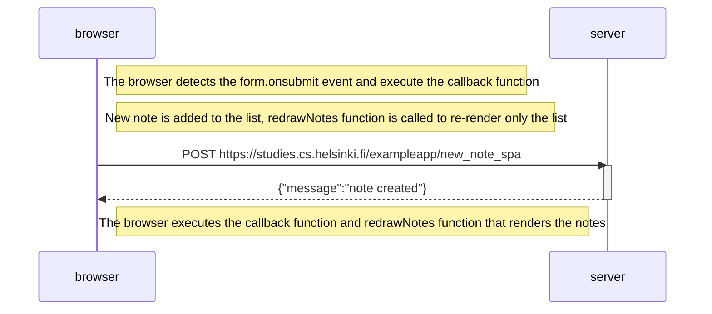

```mermaid
sequenceDiagram
    participant browser
    participant server
    
    Note right of browser: The browser detects the form.onsubmit event and execute the callback function
    Note right of browser: New note is added to the list, redrawNotes function is called to re-render only the list

    browser->>server: POST https://studies.cs.helsinki.fi/exampleapp/new_note_spa
    activate server
    server-->>browser: {"message":"note created"}
    deactivate server

    Note right of browser: The browser executes the callback function and redrawNotes function that renders the notes
```